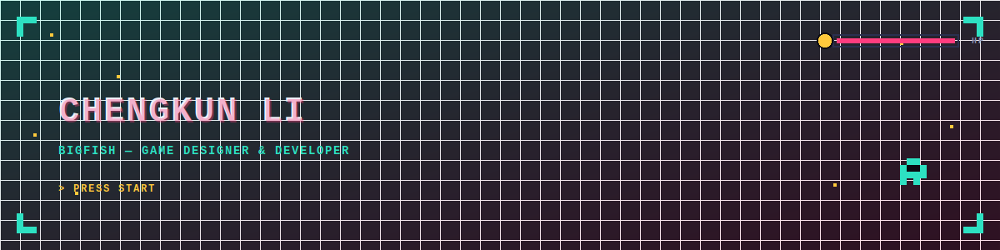

 

 

## `>` SUMMARY

UC Santa Cruz Computer Science: Game Design graduate (June 2026) based in the SF Bay Area.
Programming Lead on a Unity/C# roguelike, with shipped solo projects in Lua and JavaScript,
and UX design experience in Figma. Looking for game development or software engineering roles.

## `>` LOADOUT

**`// PROGRAMMING`**

**`// TOOLS`**

**`// DESIGN`**

## `>` PROJECT LOG

**`PROGRAMMING LEAD`** · **`PARTY x7`** · **`JAN – MAR 2026`**

### [▶ COMBAT SHUANG](https://github.com/Bigfish3012/cmpm171-2d-roguelike)
`Unity` `C#` `2D Roguelike`

Led programming for a 7-person team on a kitchen-themed 2D roguelike — built the
level-up/XP system, a crit-rate/crit-damage combat loop, and the full sound system, then
reworked aiming and dash controls after playtest feedback.

 

**`UX / PRODUCT DESIGN`** · **`APR – JUN 2026`**

### [▶ MONEYWI$E](https://www.figma.com/design/D6DGHTBiclVDzVdM9Ey27V/Low-Fidelity--Copy-?node-id=0-1&t=qpDrLICveAw0VaW1-1)
`Figma` `Personal Finance App`

Owned UX research and the core budgeting flow on a cross-functional team — from wireframes
through interactive prototypes, a heuristic evaluation, and moderated usability testing.

 

**`SOLO DEVELOPER`** · **`APR – JUN 2025`**

### [▶ CCCG](https://github.com/Bigfish3012/CMPM121-S25/blob/main/final-project/README.MD)
`Lua` `Turn-Based Card Battler`

Solo-built a lane-control card game with a scaling mana economy, a staging-and-reveal turn
cycle, an AI opponent, and a data-driven card ability system with on-reveal effects.

 

**`SOLO DEVELOPER`** · **`FEB – MAR 2025`**

### [▶ LIGHT WALL](https://github.com/Bigfish3012/CMPM-120/tree/main/Light-Wall)
`JavaScript` `Arena Survival`

Solo-built a real-time, Tron-style light-cycle arena game — AI-controlled opponents,
continuous trail-collision detection, and an elimination-order ranking system.

## `>` CONTRIBUTION FEED

